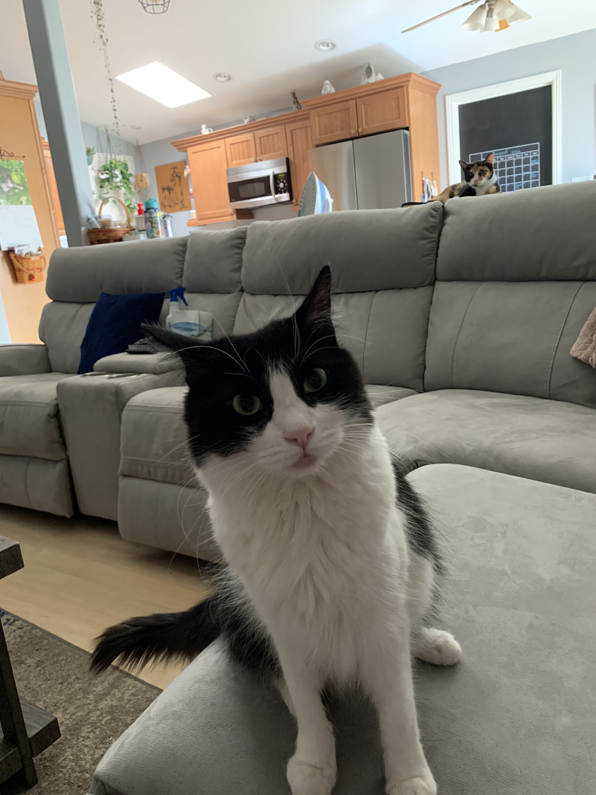
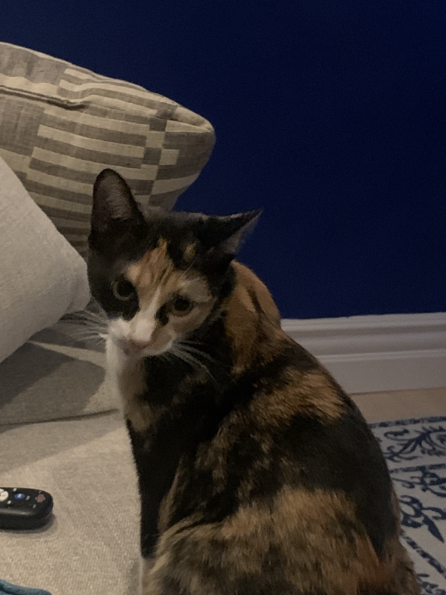
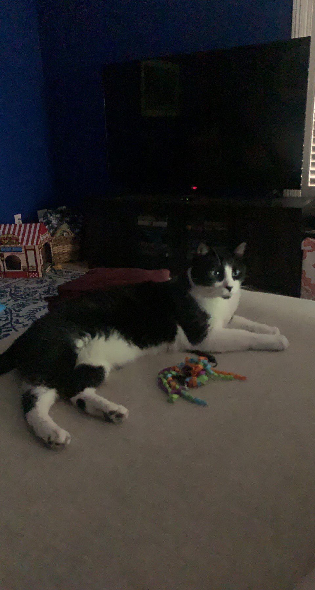
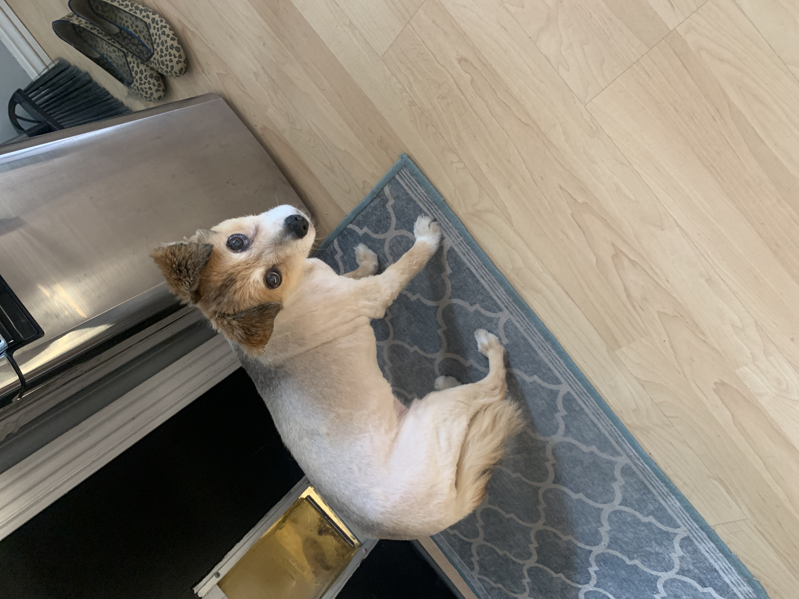

# __Jacob Graven - Computer Science Student__
Hello there! My name is **Jacob Graven** and this is my personal user page! I am 20 years old, I was born and raised in San Diego, and I study computer science at UCSD. This page will hopefully give you a little bit of information about who I am as a person and a programmer.

<br>

## **Programming Life**
I was introduced to the world of programming when I was about 10 or 11 years old. This first thing I ever did was make an HTML webpage with some dumb text on it. I only used header tags for all of my text and I also used all sorts of different sized headers because I thought you could only use each tag once (\<h1>, \<h2>, etc). The webpage looked something like this:

```
<center>
<h2>Hi my name is Jake</h2>
<h3>This is my HTML webpage :D</h3>
<h4>I am 11 years old</h4>
<h5>I have no idea what I'm doing</h5>
<h6>Help! How do I make text bigger</h6>
</center>
```

<center>
<h2>Hi my name is Jake</h2>
<h3>This is my HTML webpage :D</h3>
<h4>I am 11 years old</h4>
<h5>I have no idea what I'm doing</h5>
<h6>Help! How do I make text bigger</h6>
</center>
<br>

Around the same time, I was introduced to Roblox and Minecraft and I was obssessed with programming my own games and mods. Once again, I wasn't good at it. All of the Roblox games I made were essentially frakenstein projects with heaps of copied spaghetti code and all of the Minecraft mods I created _never_ made it out of the IDE. Still, I think these experiences were important for me and they help remind me of how far I have come.

In high school, I began to become a _much_ better programmer. In 10th grade I took my very first programming class and I made lots of basic but fun things like a calculator, a basic virtual reality browser game, and programs designed to play simple games. So far in college, I have learned a lot about UNIX systems, machine learning and genetic algorithms, and the fundamentals of computer science, like data structures and algorithms. I am also working on a few side projects at the moment, like unique wordle-type games and genetic algorithms that draw pictures.

Honestly, I'm still trying to figure out what I want to do after I graduate. Based on some of my studies, I think I may be interested in data science, artificial intelligence, and videogame design. If I had to rank my ideal careers, I think it would look something like this:

1. Videogame developer / Videogame designer
2. Data science / machine learning
3. Software engineer

I'm sure this list will change lots as I go through my last couple years at UCSD.

Finally, for future reference, I will be doing the following things to help the _programming_ side of my life:

- [x] Create my personal info page
- [ ] Refine my info page and publish programming projects to Github
- [ ] Work on my resume and apply for internships
- [ ] Finish the homework I've been procrastinating


## **Personal Life**
Besides grinding school and leetcode like a mindless worker bee, I enjoy biking and rock climbing and generally anything involving nature. My cats are also a **_huge_** part of my life and I wouldn't be the same without them. I will include pictures of all my fur babies below.

<br>

<picture>
  <center></center>
  <center><figcaption>Steve</figcaption></center>
</picture>
<br>
<picture>
  <center></center>
  <center><figcaption>Cleo</figcaption></center>
</picture>
<br>
<picture>
  <center></center>
  <center><figcaption>Cam (Camus)</figcaption></center>
</picture>
<br>

Even though I am a cat person, I can't forget about my senior dog Foxy (who just got a beautiful haircut):
<br>
<picture>
  <center></center>
</picture>

<br>

Finally, a quote from _Infinite Jest_ by David Foster Wallace:

> The man who knows his limitations, has none.

<br>

### **References and More Information**
- [Link to README.md](README.md)
- [Link to Github](https://github.com/jacobgraven)
- [Link to a song I like](https://youtu.be/UULIfPLMuDw)
<br>

_<center>_This page will be updated more in the future_</center>_